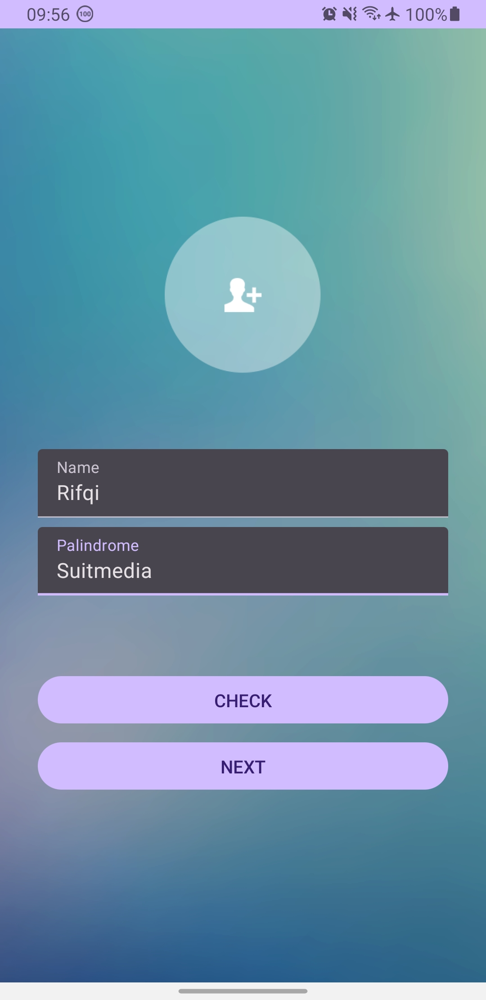
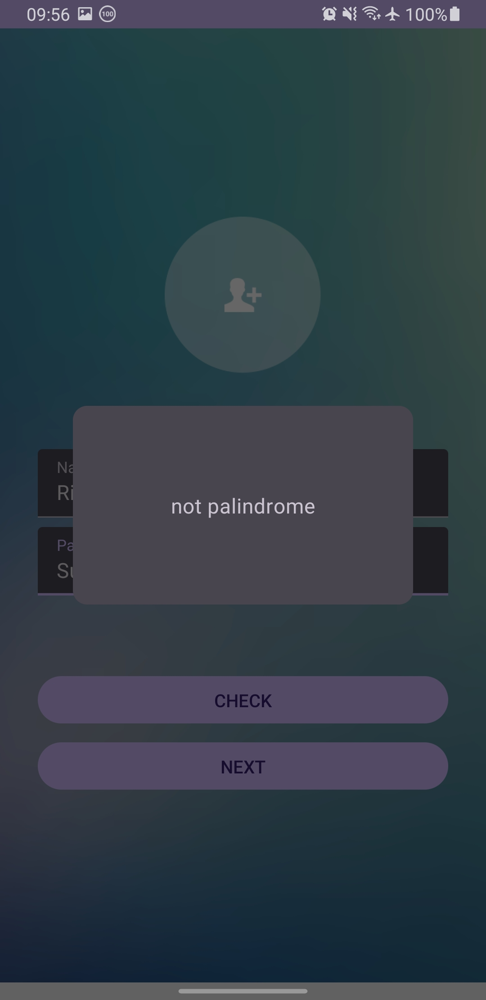
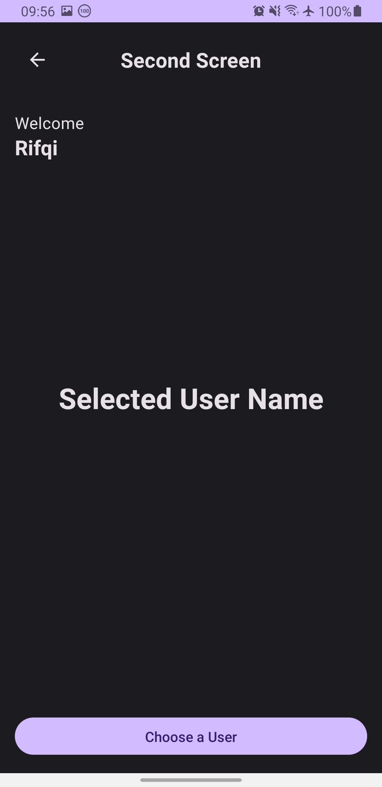
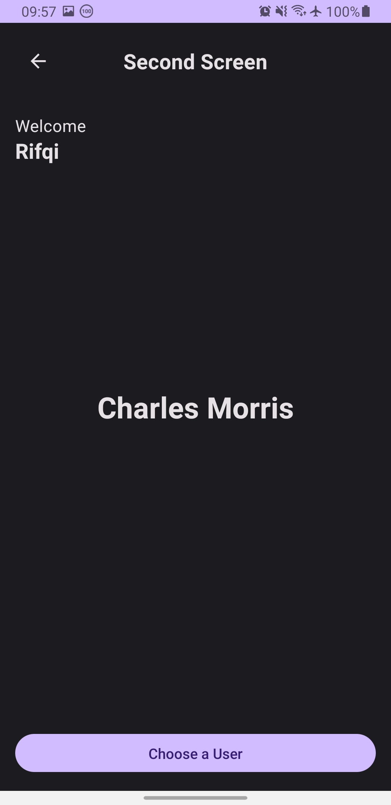
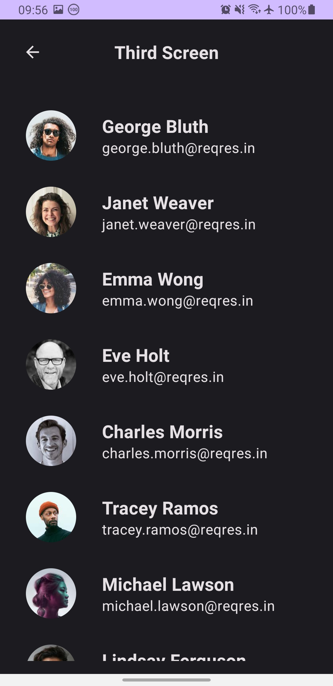
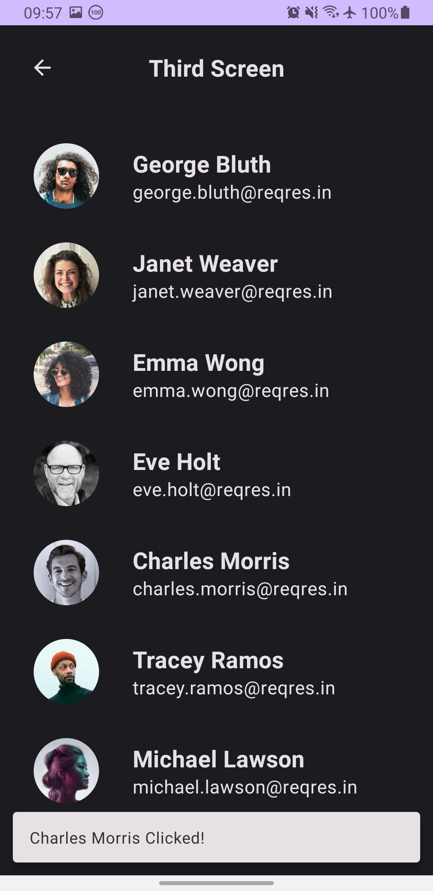
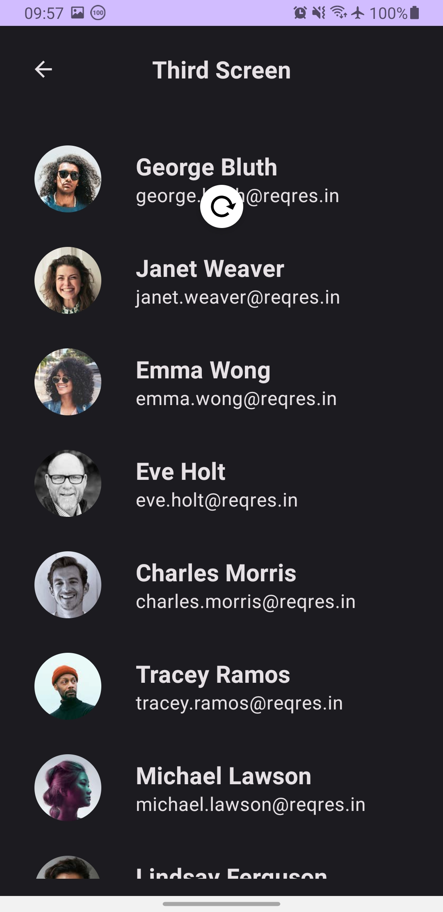

# SuitmediaTest1

## Description
Android-based mobile application, created using Android Studio, using the UI toolkit Jetpack Compose, and Retrofit for networking. The features of this application are:
1. Receive name and word palindrome input, when the user presses the "CHECK" button, a dialog will be displayed indicating whether the word is palindrome or not, when the user presses the "NEXT" button, it will move to the second screen. Both buttons will be active only when the text field is not empty.
2. Displays the name from the first screen, and will display the name of the selected user from the third screen. There is a "Choose a user" button to move to the third screen.
3. Displays user data from the reqres.in/api/users API. Displayed using Lazy Column. There is also a pull-to-refresh action. When one of the items is pressed, a SnackBar will appear containing the name of the selected user, and if the user returns to the second screen the name will be displayed.

## Screenshots
1. First Screen 
   

2. Second Screen 
 

3. Third Screen 
  
